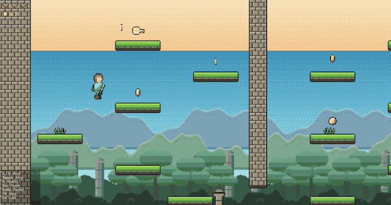
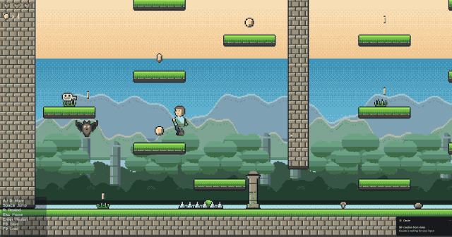
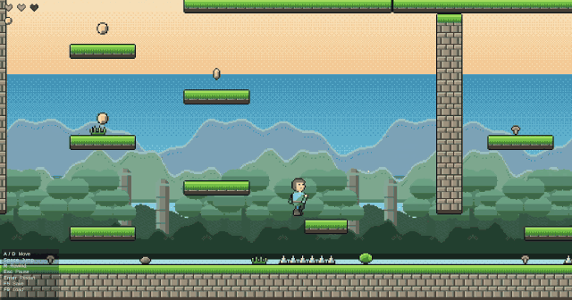
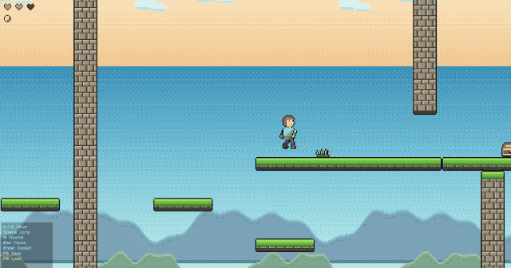

#  2D Platformer Template

A modular Unity 2D platformer showcasing core gameplay systems and clean architecture. Ideal for learning, prototyping, or extending into a complete game. All visuals are original 16-bit style pixel art.

---

##  Showcase

**Movement and pickups** 

**Rewind** 

**Parallax** six background layers.

**Level complete** 

##  Features

###  Player Controller
- Responsive horizontal movement
- Jump buffering (coyote time)
- Smooth camera follow

###  Rewind System
- Rewind of player and world state
- Works on: player, enemies, keys, doors, health
- Event-driven system with `IRewindable` interface

###  Keys & Doors
- Collect unique keys (`KeyID`-based)
- Doors auto-unlock when player has required keys
- Event-driven unlocking

###  Health & UI
- Heart-based health display
- Game Over screen when health reaches 0
- Damage on enemy contact and on spikes
- Enemies vanish after landing a hit

###  Coins
- Spinning pickups with a HUD counter
- Kept on rewind

###  Audio
- Nine chiptune effects, synthesised as WAVs in-project
- Single pooled `SfxPlayer` using `PlayOneShot`

###  Pause & Restart
- `Esc` pauses, `Enter` restarts the level
- Game over pauses automatically
- Rewinding back above 0 health clears it

###  Rewind Visuals
- Full-screen VHS effect while rewinding
- Custom Built-in RP image effect, no extra packages

###  Save System
- JSON save/load of keys, coins and elapsed time
- `F5` saves, `F9` loads

###  Input
- All bindings held in one `InputBindings` asset
- On-screen controls panel is generated from it

###  Tested
- 26 EditMode tests: inventory, wallet, health, save round-trip

###  Puzzle Level
- `PuzzleLevel.unity` — four keys, three doors, one valid order
- Final door needs a key from each wing

---

##  What It Demonstrates

This project showcases **base Unity knowledge**, including:
- Physics-based movement
- 2D raycasting and collision
- Event-driven game logic
- Rewindable state management
- Modular architecture and serialization

