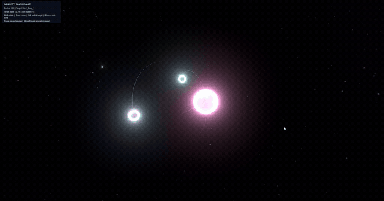
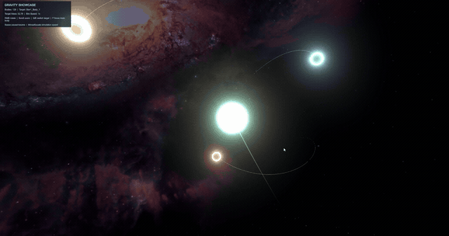
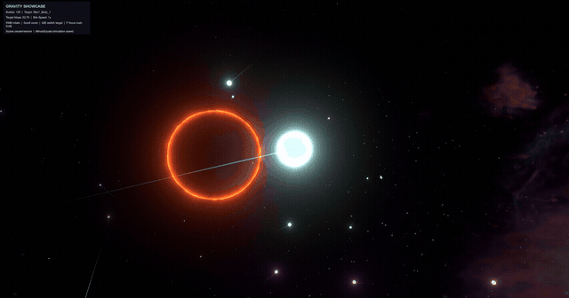
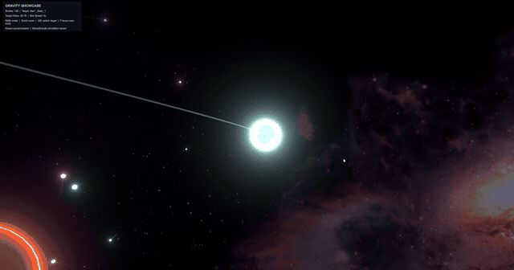

# &#x20;Gravity Simulation (Unity)

This is a custom-built gravity simulation based on the Barnes-Hut algorithm, implemented in full 3D using Unity 6.0. The project focuses on performance, scalability, and visual clarity, simulating gravitational interactions between large numbers of bodies while maintaining interactive frame rates.

##  Showcase

**Nested system**

**Wider view**

**Black hole**

## Project Goals

- Build an n-body gravity simulation that remains performant with hundreds of dynamic objects.
- Use the Barnes-Hut algorithm to approximate gravitational forces efficiently in 3D space.
- Enable recursive generation of planetary systems with configurable hierarchies (e.g. planets, moons).
- Provide an interactive camera system to explore complex orbital motion.
- Structure the codebase for extensibility, allowing for easy future enhancements.

## How It Works

- **Spatial Partitioning**: The Barnes-Hut algorithm organizes bodies into an octree structure, reducing the complexity of force calculations from O(n²) to approximately O(n log n).
- **Recursive System Generation**: Planetary systems are generated procedurally based on scriptable configuration objects, allowing nested orbits and dynamic system layouts.
- **Physics Integration**: Forces are applied per-frame, and object velocities and positions are updated using a basic integrator.
- **Camera Control**: A free-look orbit camera allows switching between tracked objects with full mouse control and zoom.

## Planned Improvements

While the core system is stable and functional, I plan to explore several optimizations and extensions:

- Migrate physics logic to Unity's Job System and Burst Compiler for multithreaded force calculations.
- Improve simulation stability with adaptive time stepping or better integration methods.
- Add UI for system configuration and visualization overlays.

## Architecture Highlights

- `GravityObject`: Represents any mass in the simulation with velocity and force accumulation.
- `BarnesHutTree` / `BarnesHutNode`: Core data structures for spatial subdivision and force approximation.
- `SystemGenerator`: Recursively generates and positions nested planetary systems.
- `SystemConfig`, `OrbitingObjectData`: Define system structure using ScriptableObjects for designer flexibility.
- `OrbitCamera`: Allows smooth tracking and control of camera focus.

## License

This project is open-source under the MIT License.

