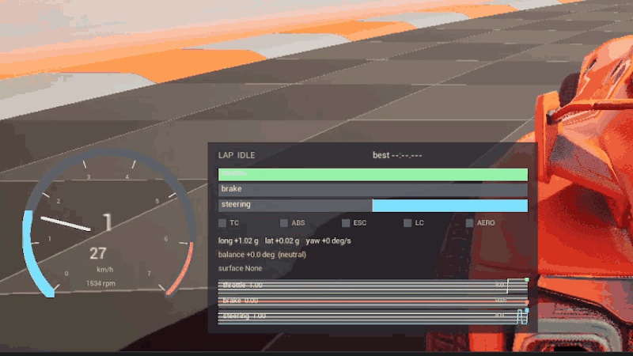
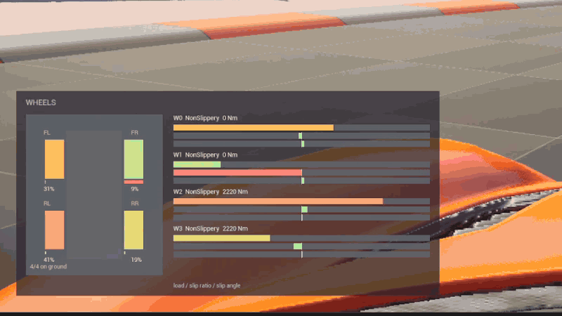
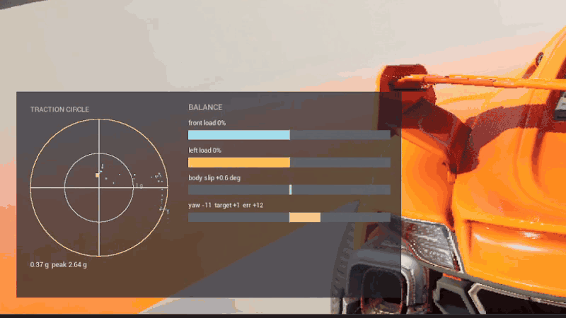
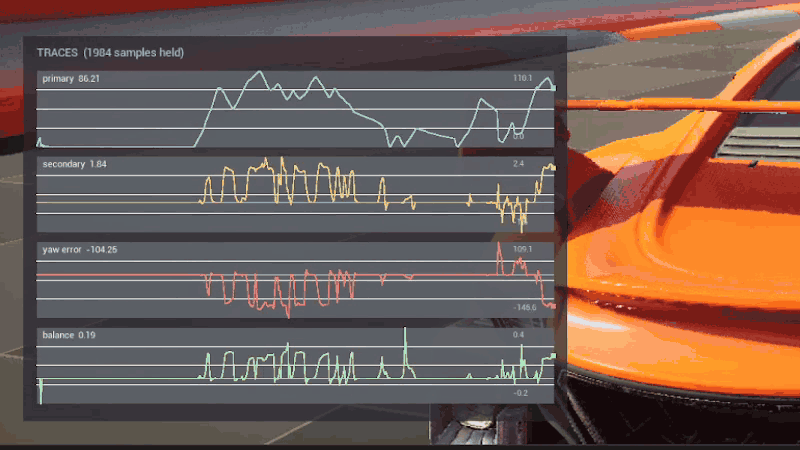
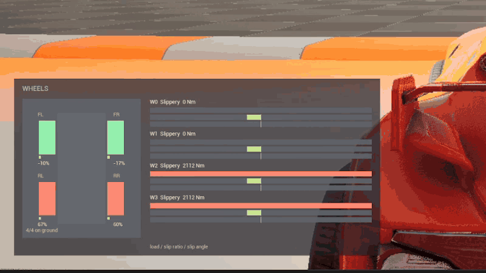
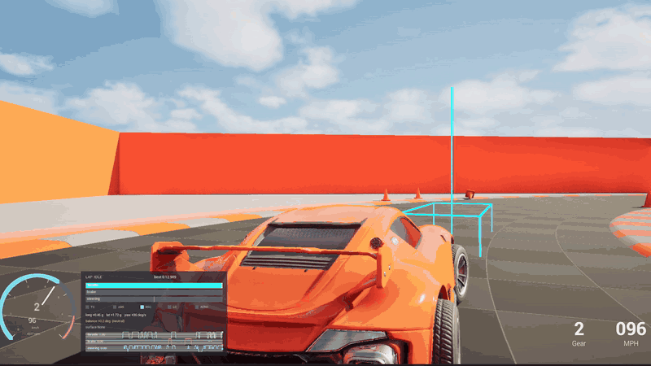

# CVS DEBUG (Unreal Engine 5)

Project showing knowledge and understanding of the Chaos Vehicles plugin. The project uses Epic's vehicle template as a base and adds debugging and telemetry tools useful in setting up and testing new vehicle setups. It records laps, exports telemetry to CSV and allows ghost replays.
It can be put into a game project to test vehicle behavior with minimal setup.

## Showcase

**Core page** — tachometer, gear and speed, throttle / brake / steering with a rolling input strip, assist lights, longitudinal and lateral g, and the understeer balance readout.



**Wheels page** — per-corner load in plan view, and for each wheel the contact surface, drive torque, normalized load, slip ratio and slip angle.



**Balance page** — traction circle with peak-g hold, front and left load split, body slip angle, and yaw rate against target.



**Graphs page** — four telemetry channels decimated straight out of the ring buffer, here holding around 2000 samples.



**Load transfer over a jump** — the wheels page with the car airborne: contact drops to 1/4, the front wheels report `air`, and load returns on landing.



**Ghost replay** — the best recorded lap played back as a ghost, caught and passed.



## Project Goals

- Demonstrate real command of the Chaos Vehicles API.
- Data-driven vehicle setup.
- Creating a useful debugging tool for projects with Chaos Vehicles.
- Build control systems (traction control, ESC, ABS, active aero) on top of Chaos.
- Turn a recorded lap into a racing line, a ghost, and an AI opponent.

## Core Systems

### Data-Driven Tuning
- Full vehicle definition as a `UPrimaryDataAsset`: chassis, aero, engine, transmission, differential, per-axle wheels and suspension.
- Optional physics-state rebuild applies the static half of a setup to a running car.

### Telemetry
- Ring-buffer history of every channel, decimated on request for plotting.
- Derived metrics: slip ratio, combined g, yaw rate, front/rear and left/right load split.
- CSV export to `Saved/Telemetry` with a column block per wheel.

### Driver Assists
- Traction control, ABS layer, electronic stability control, active aero, launch control.
- Each independently toggleable at runtime to show its effect on the same corner.

### Surface Response
- Per-`UPhysicalMaterial` friction and slip-curve scaling, applied per wheel from contact.
- Loose-surface fraction drives effect.

### Lap Recording, Ghosts and Racing Line
- Records Chaos snapshots, driver inputs at a fixed rate; best lap is kept automatically.
- Ghost actor replays a lap by interpolating recorded transforms.
- Recorded lap converts into a curvature and speed-profiled racing line.

### Race Director
- World subsystem handling countdown, laps, sector splits, live positions and results.
- Sectors derived from the reference line, so no checkpoint actors need placing.

## Controls

| Key | Action |
| --- | --- |
| `Tab` | Cycle HUD page (Off / Core / Wheels / Balance / Graphs) |
| `1` | Toggle suspension load debug draw |
| `2` | Toggle slip vector debug draw |
| `3` | Toggle racing line debug draw |
| `4` | Toggle all driver assists |
| `5` | Toggle telemetry recording |
| `Z` | Start recording a lap |
| `X` | Finish the lap and build the racing line from it |
| `V` | Play a ghost of the best lap |
| `B` | Spawn an AI opponent |
| `N` | Start a 3-lap race |
| `M` | Export telemetry to CSV |

## Console Commands

Systems are available as Console Commands:
`CVehicle.Assists.*` toggle individual systems, `CVehicle.Telemetry.*` control recording and
export, `CVehicle.Line.*` build the racing line, `CVehicle.Race.*` run a session, and
`CVehicle.HUD.*` drive the overlay.

## Architecture Highlights

- `UVehicleSetupDataAsset`: complete handling definition, split by Chaos configuration lifetime.
- `UVehicleTelemetryComponent`: sampling, derived metrics, ring buffer, CSV export.
- `UVehicleDriverAssistComponent`: traction control, ABS, ESC, active aero, launch control.
- `UVehicleSurfaceResponseComponent` / `UVehicleSurfaceTable`: contact-material driven grip.
- `UVehicleLapRecorderComponent` / `AVehicleGhostActor`: lap capture and replay.
- `FRacingLine`: resampling, curvature, speed profile, nearest-point queries.
- `AVehicleAIController`: pure-pursuit steering and PID speed tracking.
- `URaceDirectorSubsystem`: session flow, lap and sector timing, standings.
- `AVehicleTelemetryHUD`: diagnostic overlay.

## Testing

Project contains six automation tests. You can run them with:

```
UnrealEditor-Cmd.exe CVehicleArea.uproject -ExecCmds="Automation RunTests CVehicleArea;Quit" -unattended -nullrhi -nosplash
```

## Built With

- Unreal Engine 5.8
- Chaos Vehicles plugin
- C++ 
- Enhanced Input
